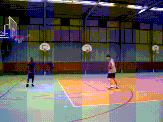
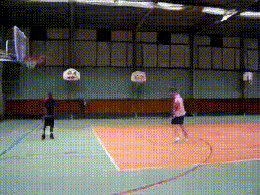
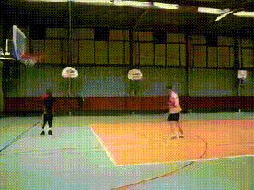
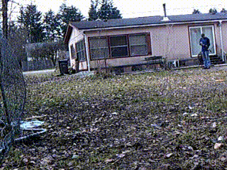

# PG-Thesis-TGADV

[[Development Log](https://crimson-plum-981.notion.site/Text-guided-Anomaly-Detection-in-Videos-1b3e4c9fc1e780548305cd08a9319426)]

**Text-guided Anomaly Detection in Videos** (Master thesis), 03/2025 - present

*Researcher*, [Kaan Akşit (Advisor)](https://kaanaksit.com/)

- This project proposes a new video anomaly detection method that integrates a multimodal autoencoder with large language models (LLM) to efficiently detect and semantically interpret abnormal events in surveillance videos. The system first leverages a pre-trained off-the-shelf variational autoencoder (VAE/VQ-VAE) to extract features from video frames, mapping high-dimensional visual data into a low-dimensional latent space. Meanwhile, a CLIP model is employed for text-visual embedding to capture critical multimodal information. Based on differences in the latent feature distributions, the system identifies anomalous regions and utilizes an LLM for contextual semantic inference, generating intuitive anomaly descriptions and providing decision support.

## Result

| GT                     | TAESD                     | TAESDV                     |
| ---------------------- | ------------------------- | -------------------------- |
|  |  |  |
|  |  |  |
|  |  |  |

| Datasets | Models | PSNR↑       | SSIM↑       | LPIPS↓     |
| -------- | ------ | ----------- | ----------- | ---------- |
| UCF-101  | TAESDV | 26.35727777 | 0.754262454 | 0.11213573 |
|          | TAESD  | 27.08109224 | 0.803559945 | 0.0867579  |
